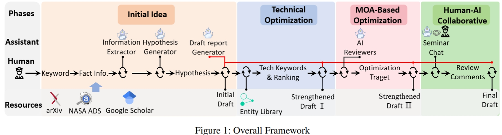

<div align="center">

<h1 align="center"> AstroInsight: Leveraging Large Language Models to Spark Idea Draft Generation in Astronomy </h1>

<p align="center">
  <a href="https://xxx">📖 Coming soon</a> •
  <a href="http://xxx/">🌐 Coming soon</a> •
  <a href="https://pan.baidu.com/s/1RoRKDlYEHglGjUsy2sI4-g?pwd=i0kc">🤗 Dataset</a> •
  <a href="#2">⌚️ Overview</a> •
  <a href="#3">🏹 QuickStart</a> •
  <a href="#4">⬇️ History Analysis</a> •
  <a href="#5">📝 Cite</a>
</p>

<div align=center></div>

<p></p>
</div>

Here, we introduced *AstroInsight* which is a framework that leverages LLMs to automatically generate preliminary drafts of astronomical research ideas. A brief overview of methodology is provided in Figure 1. The framework follows a four-stage progressive workflow. The user only needs to provide a simple input about a related research topic, and they will automatically receive an idea draft on the subject. This draft includes key components such as research motivation, topic, abstract, and other essential elements.

## 🆕 News

- **\[Nov 2024\]** We released the first version.

## 📌 Table of Contents

- [⌚️ Overview](#2)
- [🏹 QuickStart](#3)
- [⬇️ History Analysis](#4)
- [📝 Cite](#5)
- [✨ Acknowledgements](#6)
---

<h2 id="2">⌚️  Overview</h2>

<h3 id="2.1">✡️ Method Details</h3>

* 📖 **Basic Hypothesis and Draft Generation**: xxxx.
<div align=center></div>

* ❓ **Technical Entity ReRank and Linking**: xxxx.
<div align=center></div>

* 💡 **MOA-based**: xxxx.
<div align=center></div>

* 🔨 **Based on Human-AI Collaborative**: xxxx.
<div align=center></div>

<h3 id="2.2">🛒 Case Study</h3>
<div align=center></div>

<h2 id="3">🏹 QuickStart</h2>

The 'main.py'  is the entrance. Pay attention to the required APIs in the configuration method, the configuration file is in 'API'.

<h2 id="4">⬇️ History Analysis</h2>

Down history analysis data: [History Data](https://pan.baidu.com/s/1RoRKDlYEHglGjUsy2sI4-g?pwd=i0kc)

<h2 id="5">📝 Cite</h2>

```
coming soon
```

<h2 id="6"> ✨ Acknowledgements </h2>
Can contact us by below email:

Fuyong Zhao: gs.fyzhao24@gzu.edu.cn

Cunshi Wang: wangcunshi@ucas.ac.cn

